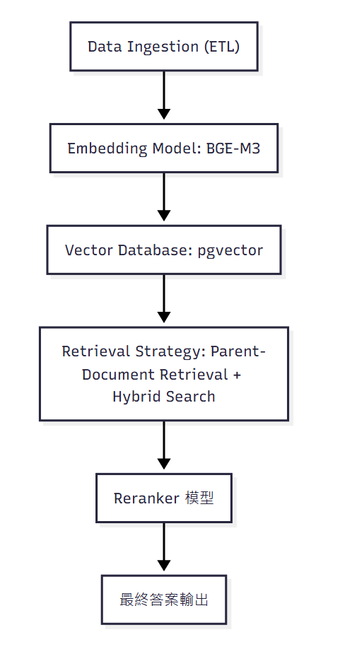

# 規格說明書 (Specs)

## 系統目標
設計一套具備可解釋性與高效檢索能力的 RAG 系統，專注於戰役戰術知識。

## 資料規格
- Chunking Strategy：
  - 固定長度：512 tokens
  - 語義切分：依照戰術章節或段落
  - Markdown 標記切分：依據標題層級 (H1/H2/H3)

## 檢索與生成流程
- Embedding Model：BGE-M3
- Vector Database：pgvector
- Retrieval Strategy：Hybrid Search + Parent-Document Retrieval
- Reranker：Cross-encoder 模型

## 性能指標
- Latency ≤ 200ms
- Top-5 準確度 ≥ 85%

## 安全與可解釋性
- 使用知識圖譜驗證避免 hallucination
- 提供檢索來源透明度

## 評估機制
- 使用 RAGAS 測試忠實度、相關性、完整度
- 使用 TruLens 監控檢索與生成過程

## 檢索與生成流程
- Embedding Model：BGE-M3 （詳見 [ADR-002](adr/adr-002.md)）
- Vector Database：pgvector （詳見 [ADR-001](adr/adr-001.md)）
- Retrieval Strategy：Hybrid Search + Parent-Document Retrieval （詳見 [ADR-003](adr/adr-003.md)）
- Reranker：Cross-encoder 模型 （詳見 [ADR-004](adr/adr-004.md)）

## 系統架構圖

> 更多理論挑戰與創新解法，請參考 [Whitepaper](whitepaper.md)。
